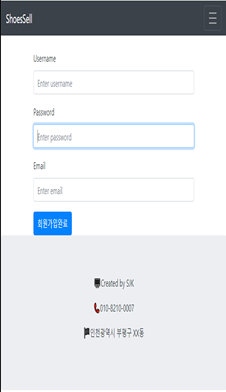
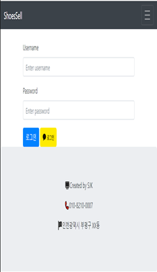
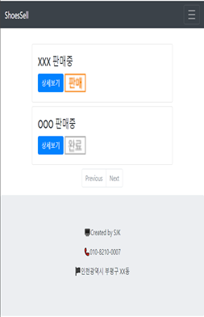
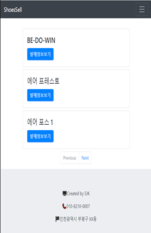

### 목차

1. 주제 선정 및 이유
2. 시장 현황
3. 제공하는 서비스
4. 필요한 기술
5. 기술 개발 목표
6. 개발 방법 및 내용
7. 기대 효과

---

# 1. 주제 선정 이유

현재 10대부터 30대 이상까지 다양하게 이르러 과거에 비해 시발에 대해 관심이 많아졌다.

과거부터 대형 신발 기업들은 특정한 날을 추첨 날짜로 잡아서 한정판 신발을 구매할 수 있게 한다.

한정판 상품들은 소비자들에게 구매 욕구를 자극한다.

특히 요즘은 리셀이라는 것을 많이 한다.

리셀은 산것을 되파는 행위를 의미하며, 현재 리셀은 재테크의 한 수단으로 본다.

한정판이고 추첨제 이기 때문에 구매를 원하는 소비자들이 추첨에 떨어져 신발을 사지 못하는 경우가 생긴다.

요즘 한정판 신발이 더 많이 나오는 추세이며 이 신발의 발매 정보들은 소비자가 직접 홈페이지를 통해 찾아야 한다.

---

# 2. 시장 현황

현재 한정판 신발을 찾기 위해서는 직접 사이트를 들어가 찾는 방법 밖에 존재하지 않는다.

신발은 여러 개가 나오지만 구매자가 놓치는 신발이 존재 할 수도 있다.

럭키드로우라는 신발 발매 정보를 알려주는 홈페이지가 있으나 거래소는 따로 존재하지 않는다.

---

# 3. 제공하는 서비스

1. 관리자가 신발 발매 정보를 올려 소비자들이 신발 발매 정보에 대해 편하게 알 수 있다.
2. 소비자들은 편하게 링크를 통해 홈페이지 링크로 들어갈 수 있다.
3. 원하는 신발이 당첨되지 않아 구매를 못한 소비자들은 거래 게시판을 통해 신발을 구매할 수 있고, 신발을 판매하고 싶은 판매자들은 신발을 판매할 수 있다.

---

# 4. 필요한 기술

1. Spring Boot
2. JPA
3. JSP
4. MySQL
5. 셀레니움

---

# 5. 기술 개발 목표

관리자는 신발 발매 정보를 발매 정보 게시판에 올리기만 하면 된다.

소비자는 관리자가 올린 발매정보를 확인하고 신발의 발매정보 게시판에서 확인할 수 있다.

관리자가 신발의 발매정보를 편하게 올리기위해 셀레니움을 사용해 웹 크롤링을 하여 업데이트 버튼만 누르면 지정된 홈페이지에서 발매정보를 게시글로 올려주도록 구현하였다.

소비자가 신발을 거래하고 싶을 시 거래 게시판으로 이동해 다른 회원과 직접 소통할 수 있다..

만약 판매가 완료되었으면 판매자가 게시판 수정에서 판매완료 버튼을 누르게되면 게시글에 '완료' 이미지가 붙게되서 다른 소비자들이 혼동하지 않도록 해준다.

---

# 6. 개발 방법 및 내용

### 회원 등록

간단한 회원 등록을 통해 웹 페이지 사이트 이용이 가능하다.

### 로그인

OAuth를 사용해 사람들이 주로 사용하는 카카오톡 메신저와 같은 SNS로 간편한 회원가입이 가능하다

### 거래 게시판

거래 게시판에서 소비자들 간의 거래가 가능하다. 또한 판매/판매완료를 구분할 수 있어 다른 소비자들이 혼동하지 않는다.

### 발매 정보 게시판

관리자가 발매 예정인 신발을 게시판에 올려 다른 소비자들이 볼 수 있게 한다.

이때 관리자는 크롤링을 통해 지정한 사이트에서 자동으로 발매 예정인 신발들을 게시글로 올려준다.

---

# 7. 기대 효과

신발 발매정보를 알고 싶은 소비자들은 편하게 링크만 확인하면 된다.

한정판 신발을 판매/구매가 가능한 거래 게시판이 존재하기 때문에 재테크 및 수집 역할을 동시에 수행 할 수 있다.

---

---

# 프로젝트에서 어려움을 느낀 부분

1. Spring Boot로 만든 첫 프로젝트여서 그런지 처음에 동작 과정이 잘 이해가 안됬다.

→ 이유 : Spring Boot의 기본적인 개념 부족 (동작원리 등)

→ Spring에 대한 기본 개념 다시 정리

1. 웹 크롤러를 구현할때 막히는 부분이 많았다. (원하는 부분을 가져오지 못함)

→ 이유 : CSS 선택자에 대해서 몰라서

부족한점 : html, css, java script 영역의 부분

→ html, css, java script 공부

---

## 사용 기술
## 사용 기술

- Spring Boot 2.4.9
- JPA
- MySQL Server 8.0
- JSP
- Selenium

### 담당 역할

전체 로직 구현 - 신재권

## 프로젝트 소개

ShoesSell은 사용자에게 신발 발매 예정 정보와 신발 거래가 가능한 웹 애플리케이션이다.

관리자가 신발 발매 예정 정보를 올려줄 수 있으며, 사용자는 발매 정보를 보거나, 거래 게시판을 통해 사용자 끼리 신발을 거래할 수 있다.

## 프로젝트 진행 기간

2021년 07월 26일 ~ 2022년 03월 31일

2021년 10월까지 메인 로직들 작성 및 AWS를 통한 배포
현재는 AWS 서버는 닫은상태

2022년 부터 3월 까지 추가 기능 구현

## 추가 구현 예정 기능

유지보수를 위한 로그 남기기

거래 프로세스를 생각해 구현 후 결제 시스템 구현

다양한 사이트 크롤링 지원

회원 탈퇴

## 프로젝트 목적

- 사용자들에게 한정판 신발 발매정보 알려주기
- 사용자 간들의 거래 제공

## 프로젝트 기대 효과

- 간단한 UI로 사용자의 접근성을 극대화하여 한정판 신발을 사기위해 필요한 정보를 쉽게 얻을 수 있음
- 사용자가 신고싶은 신발이나, 팔고싶은 신발을 팔 수 있어 경제적 이익
- 거래 프로세스를 구현할 시 수수료를 받아 관리자 측 경제적 이익

## 아쉬운 점

1. 첫 프로젝트라 구현 못했던 기능이 많다. 여유가 될 대 추가 구현 예정이다.
2. UI 문제 (부트스트랩 의존)
3. 이미지 DB 저장 (현재 썸머노트 사용)
4. 현재 나이키 사이트만 크롤링 가능
5. 클린코드가 아니다.
6. SQL 연산 최적화 x

## 성과

첫 프로젝트를 제작하면서 Spring MVC 패턴 개발, Client부터 Server까지의 흐름을 이해하게 되었다.

JPA를 더욱 활용할 수 있게 되었다.

유지보수를 위한 클린코드의 중요성을 알았다.